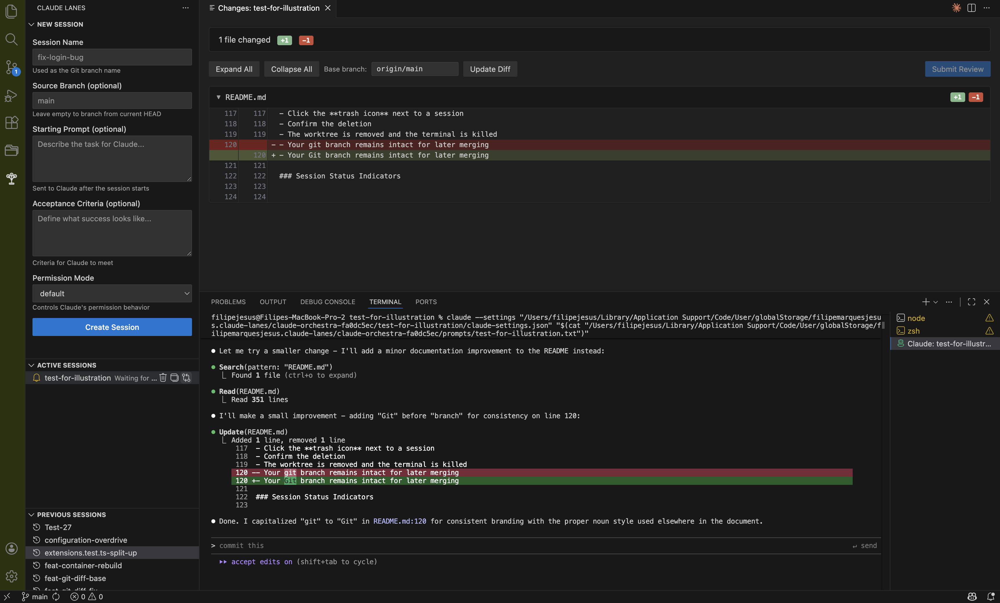

# Lanes: AI Project Management

Run multiple Claude Code sessions in parallel, each in its own isolated Git worktree. No more context contamination. No more conflicting file changes.

- **True isolation**: Every session gets its own worktree and dedicated terminal
- **Session resume**: Automatically picks up where you left off using `--resume`
- **Real-time status**: See at a glance which agents are working, waiting, or have errors
- **Built-in diff viewer**: Review all changes before merging back to your main branch
- **One-click cleanup**: Delete the worktree when done, keep the branch for merging
- **Workflow guides**: Optional structured workflows guide Claude through plan → implement → test → review phases

Visit [www.lanes.pro](https://lanes.pro) to learn more about Lanes.

## Installation

[](https://marketplace.visualstudio.com/items?itemName=FilipeMarquesJesus.claude-lanes)
[](https://open-vsx.org/extension/FilipeMarquesJesus/claude-lanes)

Install from the [VS Code Marketplace](https://marketplace.visualstudio.com/items?itemName=FilipeMarquesJesus.claude-lanes) or [Open VSX Registry](https://open-vsx.org/extension/FilipeMarquesJesus/claude-lanes).

## Example View



## Requirements

- **macOS or Linux** (Windows not currently supported, WSL may work)
- VS Code 1.75.0 or higher
- [Claude Code](https://claude.com/claude-code) installed and authenticated
- [`jq`](https://stedolan.github.io/jq/) for status tracking

## Docs

See our [documentation](https://github.com/FilipeJesus/lanes/blob/main/README.md) for more information on using Lanes.

## Using with Dev Containers

Session tracking files are stored in VS Code's global storage, which is destroyed on container rebuild. Add a named volume to persist data:

```json
{
  "mounts": [
    "source=lanes-storage,target=/root/.vscode-server/data/User/globalStorage/FilipeMarquesJesus.claude-lanes,type=volume"
  ]
}
```

> Replace `/root` with `/home/<username>` if using a non-root user.

## Known Issues

This is an early release and may contain bugs or incomplete features. Please [report issues](https://github.com/FilipeJesus/lanes/issues) on GitHub.

## Support

Enjoying Lanes? Consider supporting its development with a voluntary donation.

[](https://www.paypal.com/donate/?business=JEYBHRR3E4PEU&no_recurring=0&item_name=Loving+Lanes?+I+am+too%21+Thank+you+so+much+for+supporting+it%27s+development.&currency_code=GBP)
