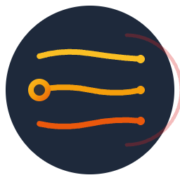

<p align="center">
  <a href="https://lanes.pro">
    
  </a>
</p>

# Lanes: AI Project Management

**Manage multiple, isolated AI coding sessions directly inside VS Code.**

Lanes uses Git Worktrees to give every agent session its own isolated file system and dedicated terminal. Supports Claude Code, Codex CLI, and Gemini CLI out of the box. No more context contamination. No more half-finished files clashing with each other.

<video src="https://raw.githubusercontent.com/FilipeJesus/lanes/main/media/lanes-demo.mp4#t=4" autoplay loop muted playsinline controls alt="Lanes in action"></video>

---

## Features

- **True Isolation** - Each session gets its own Git worktree and dedicated terminal
- **Session Resume** - Automatically resumes where you left off using `--resume`
- **Real-Time Status** - See which agents are working, waiting, or have errors
- **Built-in Diff Viewer** - Review all changes before merging back
- **One-Click Cleanup** - Delete the worktree when done, keep the branch for merging
- **Workflow System** - Optional MCP-based workflows guide agents through structured phases (plan → implement → test → review)
- **Multi-Agent Support** - Claude Code, Codex CLI, Gemini CLI, and Cortex Code with inline logo selector for easy switching
- **File Attachments** - Drag-and-drop files into the session form to include with your prompt
- **Tmux Terminal Backend** - Persistent tmux sessions via `lanes.terminalMode` setting
- **Local Settings Propagation** - Auto-propagate `.claude/settings.local.json` and `.gemini/settings.json` to worktrees

Visit [our website](https://lanes.pro) for more information.

---

## Quick Start

### Platform Support

- **macOS** - Fully supported
- **Linux** - Fully supported
- **Windows** - Not currently supported (WSL may work)

### Prerequisites

```bash
# Install Claude Code
npm install -g @anthropic-ai/claude-code
claude login

# Install jq (required for status tracking)
brew install jq          # macOS
sudo apt-get install jq  # Ubuntu/Debian

# Optional: Install Codex CLI for OpenAI agent support
npm install -g @openai/codex

# Optional: Install Gemini CLI for Google agent support
npm install -g @google/gemini-cli
gemini
```

### Install

Search for **"Lanes"** in the VS Code Extensions marketplace, or visit the [VS Code Marketplace](https://marketplace.visualstudio.com/items?itemName=FilipeMarquesJesus.lanes).

**From Source:**

```bash
git clone https://github.com/FilipeJesus/lanes.git
cd lanes && npm install
npm run compile && npx vsce package
# Then install the .vsix via "Extensions: Install from VSIX..."
```

**Or use the local install script:**

```bash
./scripts/install-local.sh
```

This compiles, packages, and installs the extension in one command.

---

## Usage

1. Open the **Lanes** sidebar
2. Fill in **Session Name** and optionally a **Starting Prompt**
3. Click **Create Session**
4. A terminal opens with Claude running in an isolated worktree

Click any session to resume it. Click the trash icon to delete (branch is preserved for merging).

---

## Gemini CLI Notes

- **Authentication**: Configure your Gemini API key (e.g., `GEMINI_API_KEY`) before launching Gemini CLI sessions.
- **MCP workflows**: Lanes writes MCP server config into `.gemini/settings.json` when workflows are enabled.
- **Resume behavior**: Lanes resumes Gemini sessions using `gemini --resume` without an explicit session ID, which picks the most recent session for that project. If you run multiple Gemini sessions in the same worktree, the latest one is resumed.
- **Status tracking**: Gemini CLI hooks update `working`/`waiting_for_user`/`idle` status via `.gemini/settings.json`.

---

## Commands

| Command | Description |
|---------|-------------|
| `Lanes: Create Session` | Create a new isolated session |
| `Lanes: Open Session` | Open/focus an existing session's terminal |
| `Lanes: Delete Session` | Remove a session's worktree and terminal |
| `Lanes: Clear Session` | Reset session state while preserving the worktree |
| `Lanes: Show Git Changes` | Open the diff viewer for a session |
| `Lanes: Create Terminal` | Create an additional terminal for a session |
| `Lanes: Search in Worktree` | Open VS Code search scoped to a session's worktree |
| `Lanes: Repair Broken Worktrees` | Fix broken worktrees after container rebuilds |
| `Lanes: Setup Status Hooks` | Configure Claude hooks for status indicators |

---

## Advanced

- **[Claude Harness & Workflows](docs/CLAUDE-HARNESS.md)** - Structured task management and MCP-based workflow guides for long-running sessions
- **[Website](https://lanes.pro)** - Full documentation and guides

---

## Roadmap

- [x] Session status indicators (idle, working, waiting)
- [x] Session resume functionality
- [x] Session templates for common workflows
- [x] Multi-agent support (Claude Code + Codex CLI)
- [x] File attachments in session form
- [x] Tmux terminal backend
- [x] Local settings propagation to worktrees
- [x] Additional agent integrations
- [ ] Windows support
- [ ] Multi-repo support

---

## Contributing

Contributions are welcome!

### Development Setup

```bash
git clone https://github.com/FilipeJesus/lanes.git
cd lanes
npm install
```

Press `F5` in VS Code to launch the Extension Development Host.

### Scripts

```bash
npm test          # Run tests
npm run lint      # Run ESLint
npm run compile   # Compile TypeScript
npm run watch     # Watch mode for development
```

### Pull Request Guidelines

1. Fork the repo and create a feature branch (`git checkout -b feature/amazing-feature`)
2. Make your changes and ensure tests pass
3. Commit with clear messages
4. Push and open a Pull Request

Please ensure your PR:
- Passes all existing tests (`npm test`)
- Includes tests for new functionality
- Follows the existing code style (`npm run lint`)

### Project Structure

| File | Purpose |
|------|---------|
| `src/extension.ts` | Main entry point, commands, terminal management |
| `src/AgentSessionProvider.ts` | Active sessions tree view |
| `src/PreviousSessionProvider.ts` | Previous sessions tree view |
| `src/SessionFormProvider.ts` | New session form webview |
| `src/GitChangesPanel.ts` | Git diff viewer panel |
| `src/gitService.ts` | Git operations (worktrees, branches) |
| `src/ProjectManagerService.ts` | Project Manager integration |
| `src/codeAgents/` | Agent abstraction (CodeAgent, ClaudeCodeAgent, CodexAgent, factory) |
| `src/services/TmuxService.ts` | Tmux terminal backend |
| `src/services/TerminalService.ts` | Terminal management abstraction |
| `src/services/SettingsFormatService.ts` | TOML/JSON settings format handling |
| `src/localSettings.ts` | Local settings propagation helper |
| `src/test/*.test.ts` | Test suite |
| `package.json` | Extension manifest |

---

## License

MIT - see [LICENSE](LICENSE) for details.

---

## Support

Enjoying Lanes? Consider supporting its development with a voluntary donation.

[](https://www.paypal.com/donate/?business=JEYBHRR3E4PEU&no_recurring=0&item_name=Loving+Lanes?+I+am+too%21+Thank+you+so+much+for+supporting+it%27s+development.&currency_code=GBP)

---

## Links

- [Website](https://lanes.pro)
- [GitHub Repository](https://github.com/FilipeJesus/lanes)
- [Report Issues](https://github.com/FilipeJesus/lanes/issues)
- [Claude Code Documentation](https://claude.com/claude-code)
